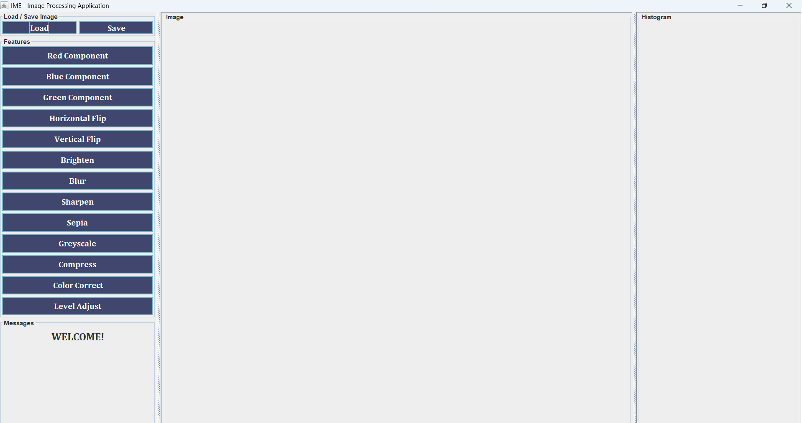
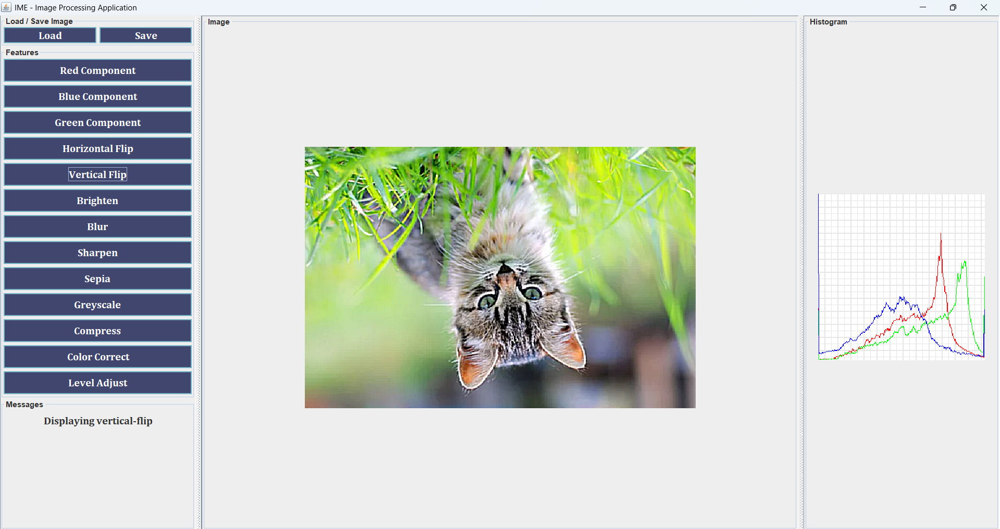
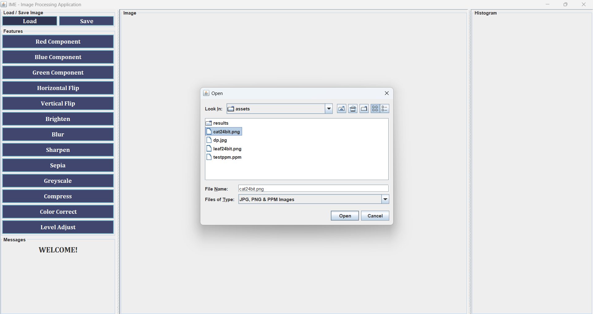
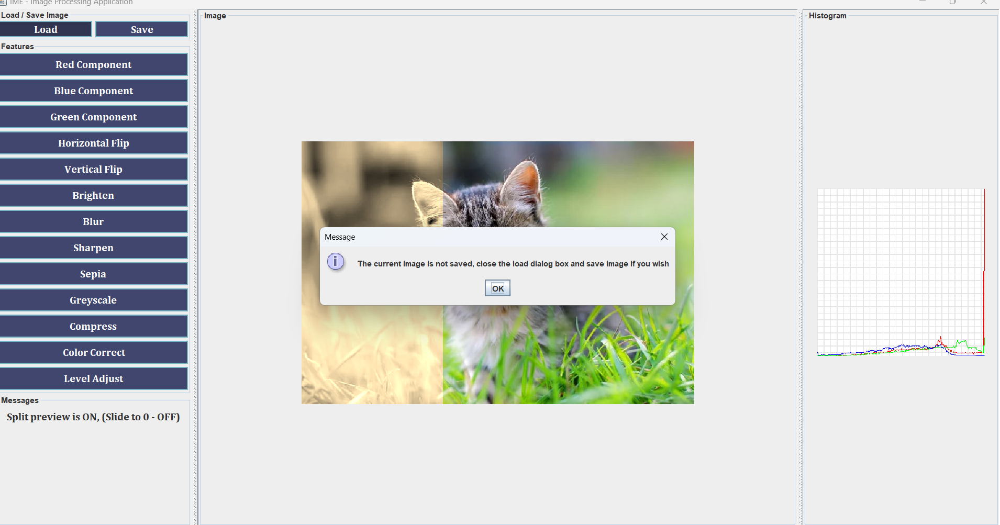
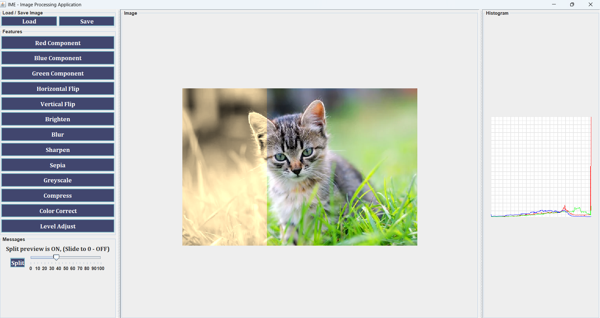
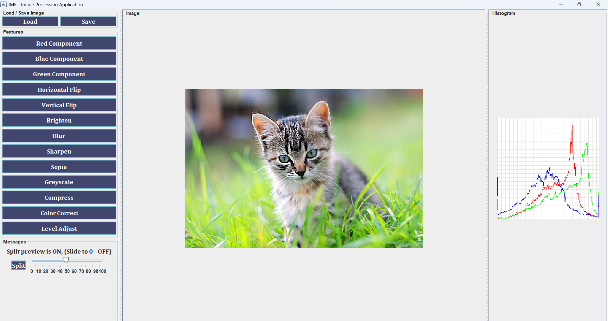
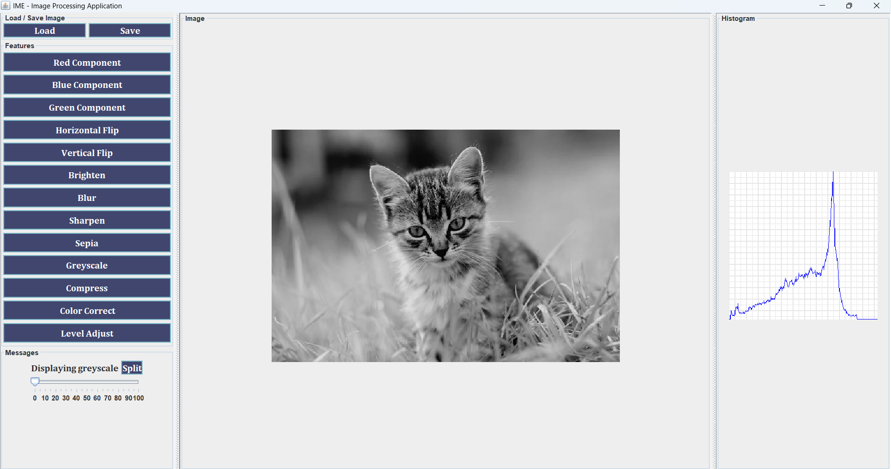
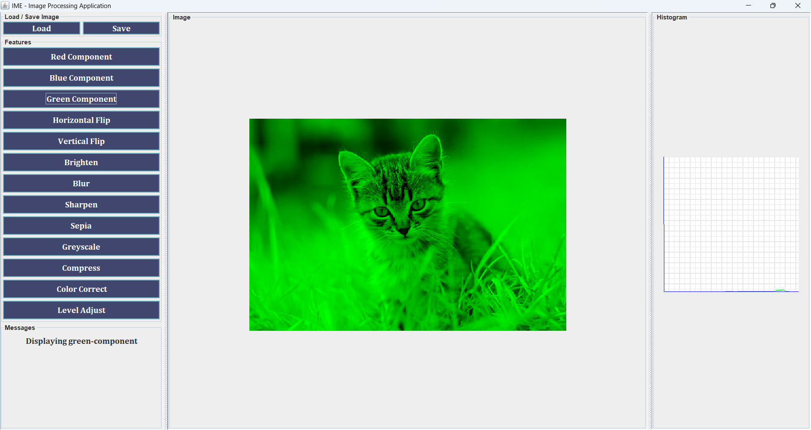
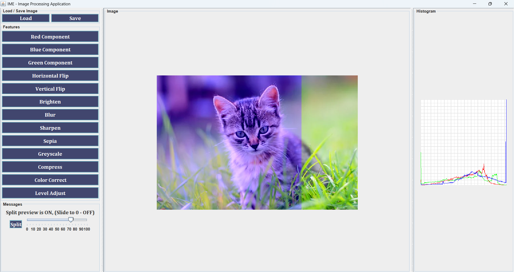

# 🌟 Pixelate - An Image Processing Application

> ⚡ A Java-based **Image Processing Application** with a clean MVC architecture, supporting multiple filters, color corrections, histogram generation, compression, and more.

📌 **Note**: Please refer to **USEME.md** for usage instructions.

---

## 📸 Snapshots

#### 🖼️ Welcome Page

#### 🔄 Vertical Flip

#### 📂 Load Image

#### ⚠️ Error when trying to load another image before saving current work

#### 🎨 Sepia Feature

#### ✨ Sharpen Feature

#### ⚫ Greyscale Feature

#### 🟢 Green Component Feature

#### 🎨 Color Correct Feature

---

## 📖 Overview

This image processing program is designed to perform **various operations on images of several formats**.  
It follows the **MVC (Model-View-Controller)** architecture to ensure modularity, scalability, and maintainability.

---

## 🧩 Classes and Interfaces

1. **`imagecontroller`**: Interface defining the contract for handling script commands.
2. **`ImageControllerImpl`**: Main controller implementation that executes user commands.
3. **`imagemodel`**: Interface defining image processing operations (color components, flipping, filters, etc.).
4. **`ImageModelImpl`**: Implements `imagemodel`, providing concrete image operations.
5. **`ImageConvert`**: Utility class for converting between 3D integer arrays and `BufferedImage`.
6. **`imageview`**: Interface for displaying messages to the user.
7. **`ImageViewImpl`**: Console-based implementation of `imageview`.
8. **HandleFilters package**: Contains classes handling specific image operations.
9. **`ExtendedImageModel`**: Interface extending `imagemodel` with additional features.
10. **`ExtendedImageModelImpl`**: Implementation adding support for advanced image processing.

---

## 🖼️ Image Sources

- **dp.jpg** → Personal image (owned by the author).
- **cat24bit.png** → From [Deposit Photos](https://depositphotos.com/photos/small-cat.html).
- **leaf24bit.png** → From [Wikipedia](https://en.m.wikipedia.org/wiki/File:24_bit.png).

✅ Images are authorized for use only within this program.

---

## 🔧 Changes & New Features

### ⚙️ General Design Justifications

- Strict **MVC architecture** maintained.
- No changes in original `ImageModel` / `ImageView` and their implementations.
- Introduced `ExtendedImageModel` & `ExtendedImageModelImpl` for new features.
- Used **Command Design Pattern** for easy feature integration.
- Controller updated to pass `ExtendedImageModel` to support old + new features seamlessly.

---

### 🗜️ Compress

- **Description**: Creates a compressed version of an image with a given percentage.
- **Changes**: Added `HandleCompress` class in `handleFilters`. Calls `compress()` in extended model.

---

### 📊 Histogram

- **Description**: Generates a histogram image (256×256) with RGB line graphs.
- **Changes**: Added `HandleHistogram` class in `handleFilters`. Uses `generateComponentHistogram()`.

---

### 🎨 Color Correct

- **Description**: Aligns histogram peaks to correct image colors.
- **Changes**: Added `HandleColorCorrection` class in `handleFilters`. Uses `findMeaningFullPeaks()`.

---

### 🎚️ Level Adjust

- **Description**: Adjusts levels using black, mid, and white values (0–255).
- **Changes**: Added `HandleLevelAdjust` class in `handleFilters`. Uses `applyLevelAdjustment()`.

---

### 🖼️ Split Parameter Support

- **Optional split argument** added to multiple commands.
- Conditional checks in `handleFilters` classes decide whether to apply split functionality.
- Introduced **`ExtendedImageModelImpl`** to handle split operations.

**Justification:**
1. ✅ **Minimal changes** to existing code.
2. ✅ Maintains **modularity & extensibility**.

---

### 📜 Script File Support

- Added support for **running script files via command-line options**.
- Implemented in `main()` of `ImageControllerImpl`.
- Reuses existing `executeScriptFromFile()` method — no core changes made.

---

## 🎯 Key Highlights

- ✅ Clean MVC Architecture
- ✅ Extendable via Command Pattern
- ✅ Advanced Features: Compress, Histogram, Color Correct, Level Adjust, Split View
- ✅ Script Execution Support
- ✅ Backward Compatibility Maintained

---

## 📬 Feedback

💡 Have suggestions or found a bug?  
Reach out at **ahirviral01@gmail.com**

---

## ⭐ Support

If you like this project, don’t forget to **star ⭐ the repo** and share it with others!  
